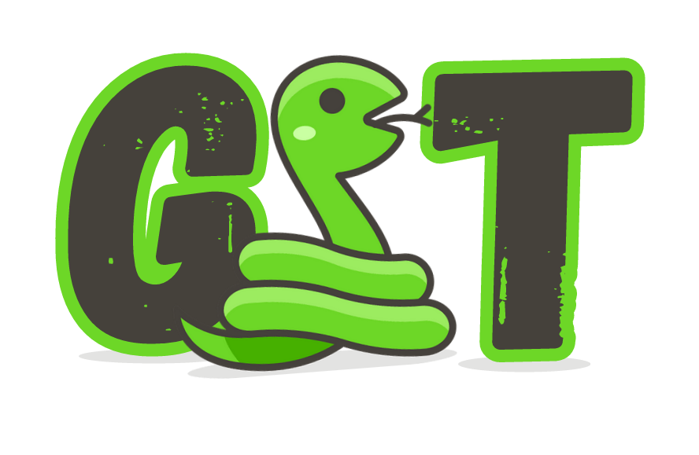

# Snake
Strategic Neural Analysis and Knowledge Enhancement. 
Initialize a neural network with pre-trained weights and let all weights be adjusted with the new training.

**Description:** 
a chrome extension that extracts text from web pages, and answer the user questions depending on the content extracted from web page visited by help of large language model.

# How to run 

### With the extension
Clone the repo to your local machine
```shell
   cd repo_directory
```

Run the backend APIs
```shell
    cd snake/backend
 ```

 ```shell
    npm start
  ```

Run the llm APIs
```shell
    python llmAPIs.py
```
Now open the extension and interact with your llm

### With the UI
Run the llm APIs
```shell
    python llmAPIs.py
```
Run the UI
```shell
   cd localGPTUI
```
```shell
    python localGPTUI.py
```
The UI will be Running on ```http://127.0.0.1:5111```

## Extension:
The Google Chrome extension is a vital component of the project, providing a user-friendly interface for interacting with both the web content and the backend APIs.

### Functionality
The extension serves several key functions, enabling seamless interaction between the user, web content, and backend APIs:

#### 1. Data Scraping:
* The extension allows users to scrape data from the currently active tab in the Chrome browser. This scraped data is sent to the backend APIs for further processing.
#### 2. User Prompt Input:
* A prominent input field in the extension's UI allows users to enter prompts. These prompts are sent to the backend APIs to generate relevant responses.
#### 3. API Communication:
* The extension facilitates communication with the backend APIs using HTTP requests. It sends both scraped data and user prompts to their respective API endpoints.
#### 4. Display of Responses:
* The extension displays responses received from the backend APIs in a designated answer field. This real-time interaction enables users to quickly view the results of their prompts.

### Interaction with Backend APIs
The Chrome extension collaborates closely with the backend APIs to ensure smooth data exchange and response handling:

* Scraped Data:
   *  The extension uses HTTP POST requests to send scraped data to the backend API's ```/content``` endpoint.

* User Prompts:
   * The extension sends user-entered prompts to the backend API's ```/prompt``` endpoint.

These interactions enable the extension to act as an intermediary, providing a user-friendly interface while effectively communicating with the backend to process data and generate responses.


## SnakeLocalGPT
1. **Device Configuration:**
   - The application is set to use the CPU for processing.
   - Source documents are configured to be displayed as needed.

2. **Embeddings and Chroma Database Initialization:**
   - HuggingFaceEmbeddings instance is initialized using a specified model name.
   - A Chroma database is created with settings for persistence and embedding functions.
   - The database is converted into a retriever object.

3. **Model Selection and Configuration:**
   - Model identifiers (model_id and model_basename) are specified.
   - PromptTemplate and ConversationBufferMemory instances are initialized.
   - The Load LLM model function is used to load the model.

4. **Convert Content to PDF and Save:**
   - An API route allows for the conversion of content to PDF format.
   - The content is saved in a specified directory as a PDF file.

5. **Run Ingest Process:**
   - Another API route triggers the ingest process.
   - The "ingest.py" script is executed with optional arguments.
   - The Chroma database, retriever, and QA models are loaded from the persist directory.

6. **Accept User Prompt and Provide Answer:**
   - An API route accepts a user prompt.
   - The QA model processes the prompt and generates an answer.
   - The answer and source documents used are returned as a JSON response.


## Back-end APIs
### Content API:
The Content API is responsible for managing content-related operations and interactions with the Chrome extension and the Local GPT LLM.

1. **Retrieve All Content:**
   - Route: GET "/"
   - Fetches all content documents from the database and returns them as a JSON response.

2. **Retrieve Content by ID:**
   - Route: GET "/:contentId"
   - Retrieves a specific content document based on the provided content ID and returns it as a JSON response.
   - 
3. **Create New Content:**
- Route: POST "/"
- Accepts content ID and content data in the request body.
- Calls `SaveContent` function to handle content creation and processing.

4. **SaveContent Function:**
- Asynchronously saves content to the database.
- Checks if the provided content ID already exists; returns an error if it does.
- Creates a content document with content ID, content data, and empty prompts array.
- Saves the content document to the database.
- Calls `pdfEndPoint` and `ingestEndPoint` functions for further processing.
- Responds with a success message and the saved content data or an error message.

5. **pdfEndPoint Function:**
- Asynchronously sends a POST request to convert content to PDF.
- Constructs the endpoint URL and prepares data to be sent.
- Handles response and logs success or error messages.

6. **ingestEndPoint Function:**
- Asynchronously sends a GET request to run ingest processes.
- Constructs the endpoint URL.
- Handles response and logs success or error messages.


The Content API serves as an intermediary for handling content-related tasks and coordinating interactions between the extension and the LLM.


## Prompt API:
The Prompt API is responsible for managing prompt-related operations and communication between the Chrome extension and the LLM.

1. **Retrieve Prompt Data:**
   - Route: GET "/"
   - Returns a JSON response indicating that prompt data has been fetched.

2. **Create New Prompt:**
   - Route: POST "/"
   - Accepts prompt data and content ID in the request body.
   - Calls savePrompt and sendPrompt functions for processing and communication.
   - Responds with the received answer or an error message.

3. **Send Prompt Data to Another API:**
   - Function: sendPrompt(promptData, res)
   - Sends a POST request to a specified endpoint with user prompt data.
   - Handles response, logs data, and responds with the received answer.

4. **Save Prompt Data:**
   - Function: savePrompt(promptData, res)
   - Creates a new prompt document and associates it with the corresponding content.
   - Saves the prompt and updates the content document.
   - Handles errors and responds with appropriate messages.

The Prompt API facilitates the creation and communication of prompts between the extension and the LLM, ensuring seamless interactions and data exchange.


## Data Flow
https://www.figma.com/file/nUaAfW1Laigb9w9ST6AaQL/SnakeGPT-Data-Flow?type=whiteboard&node-id=0%3A1&t=YiAwkeg1bdj1WqV1-1
